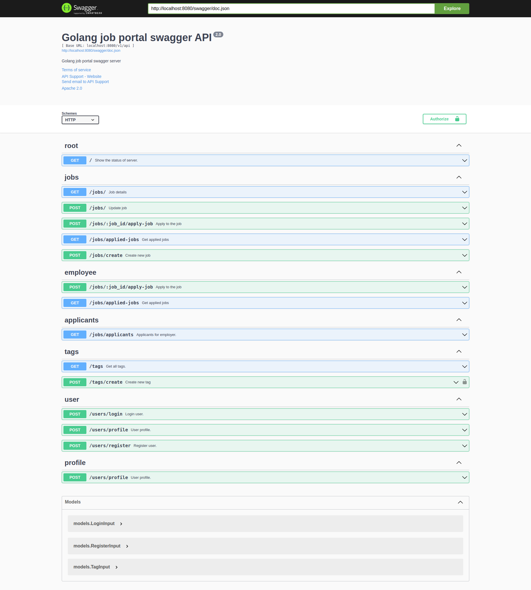

# Job Portal

## Features

- **User Authentication**: Secure user registration and login.
- **Job Listings**: Create, read, update, and delete job listings.
- **Applicant Management**: Manage applicants for job listings.
- **Search and Filter**: Search and filter job listings based on various criteria.
- **Notifications**: Email notifications for job application status updates.
- **Role-Based Access Control**: Different access levels for users and administrators.
- **Responsive Design**: Mobile-friendly user interface.

## Screenshots

## Swagger API Documentation


### Prerequisites

- Go 1.22.8 or higher
- PostgreSQL
- Docker (optional, for containerization)

### Steps

1. **Clone the repository:**

    ```sh
    git clone https://github.com/manjurulhoque/job-portal.git
    cd job-portal
    ```

2. **Set up environment variables:**

   Copy the `.env.sample` file to `.env` and update the values as needed.

    ```sh
    cp .env.sample .env
    ```

3. **Install dependencies:**

    ```sh
    go mod tidy
    ```

4. **Run the application:**

    ```sh
    go run main.go
    ```

5. **Run with Docker (optional):**

    ```sh
    docker-compose up --build
    ```

6. **Access the application:**

   Open your browser and navigate to `http://localhost:8080/swagger/index.html`.


## Tech Stack

- **Backend**:
    - Go (Golang)
    - GORM (ORM for Go)
    - PostgreSQL (Database)
    - JWT (JSON Web Tokens)

- **DevOps**:
    - Docker (Containerization)

- **Testing**:
    - Go testing framework
    - Postman (API testing)

